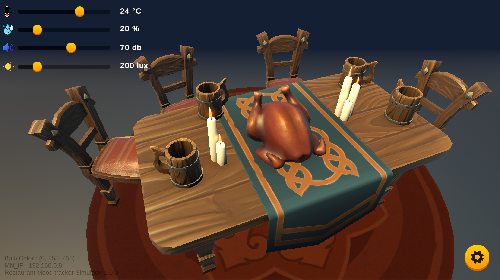

# restaurant-simulator
Restaurant simulator made with unity. 

This corresponds to **ADN-AE** and simulates four sensors. 
A light sensor, a noise sensor, a temperature sensor, and a smart bulb. \
It sends the data it collects to MN, and it's up to MN to decide what to do with it.
## Feature
* simulate sensor values
* change lighting

## Structure

## About Security
All communication is encrypted with HTTPS, and man-in-the-middle(MitM) attacks are prevented by the use of X.509 certificates.